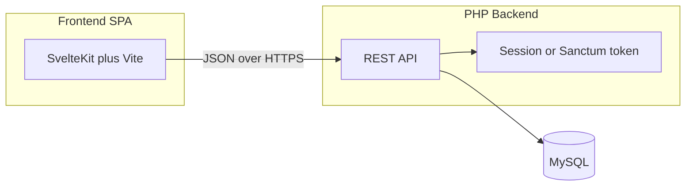

# Home Inventory: PHP REST API + Separate Frontend

## Recommended architecture




| Layer     | Choice                                                                                              | Why                                                                                                             |
| --------- | --------------------------------------------------------------------------------------------------- | --------------------------------------------------------------------------------------------------------------- |
| API       | **PHP 8.2+** with **Slim 4** (or Laravel API-only if you prefer batteries-included auth/migrations) | Slim keeps the backend small and REST-focused; Laravel is fine if you want built-in auth and ORM out of the box |
| Database  | **MySQL 8**                                                                                         | Already in your project goal; good for relational inventory data                                                |
| Frontend  | **SvelteKit + TypeScript**                                                                          | Official Svelte framework (Vite-based), lightweight components, file-based routing, easy REST integration       |
| Auth (v1) | **Single household, 1–2 users** via Laravel Sanctum or Slim + session/JWT                           | No multi-tenant complexity; one `users` table is enough initially                                               |


## Core data model (MVP)

Start with four tables — enough to track what you own, where it is, and how to find it:

- `**users`** — email, password hash (household login only)
- `**locations**` — e.g. Kitchen, Garage, Shelf A (hierarchical optional later via `parent_id`)
- `**items**` — name, description, quantity, unit, `location_id`

Defer until later: photos, barcodes, warranties, loans, audit history, purchase details, serial numbers, notes, timestamps.

## REST API surface (v1)

Base path: `/api/v1`


| Method           | Endpoint       | Purpose                            |
| ---------------- | -------------- | ---------------------------------- |
| POST             | `/auth/login`  | Login, return token/session        |
| POST             | `/auth/logout` | Logout                             |
| GET/POST         | `/items`       | List (with search/filter) / create |
| GET/PATCH/DELETE | `/items/{id}`  | Read / update / delete             |
| GET/POST         | `/locations`   | Manage locations                   |
| GET/POST         | `/categories`  | Manage categories                  |


Use consistent JSON responses: `{ "data": ... }` on success, `{ "error": { "message", "code" } }` on failure. Validate input server-side; never trust the frontend.

## Suggested repo layout

```
hive-stock/
├── backend/          # PHP API (Composer, Slim or Laravel)
│   ├── public/       # Web root (index.php)
│   ├── src/          # Controllers, services, middleware
│   └── migrations/   # SQL or framework migrations
├── frontend/         # SvelteKit app
│   └── src/
│       ├── lib/
│       │   └── api/  # fetch wrappers for REST calls
│       └── routes/   # Login, items, locations, categories
├── docker-compose.yml  # optional: php, mysql, node for local dev
└── README.md
```

## Frontend pages (v1)

1. **Login** — email/password, store auth token
2. **Dashboard / Item list** — search, filter by location/category, sort
3. **Item detail / edit** — create and update items (name, description, quantity, unit, location, category)
4. **Settings** — manage locations and categories (simple CRUD screens)

Use a small `lib/api/client.ts` that attaches the auth header and handles 401 redirects to login. SvelteKit route guards (e.g. `+layout.server.ts` or client-side checks in `+layout.svelte`) protect authenticated pages.

## Security essentials (even for one household)

- Passwords: `password_hash()` / bcrypt (or framework defaults)
- Prepared statements / ORM only — no string-concatenated SQL
- CORS restricted to your frontend origin in dev/prod
- HTTPS in production
- Rate-limit login endpoint if exposed publicly

## Local development

Two practical options:

1. **Docker Compose** — `php-fpm` + `nginx` + `mysql` + frontend dev server (recommended; reproducible)
2. **Laragon/XAMPP** — PHP + MySQL locally, `npm run dev` for frontend with Vite proxy to `http://localhost:8080/api`

## Implementation phases

### Phase 1 — Backend skeleton

- Initialize Composer project in `[backend/](backend/)`
- Configure MySQL connection via environment variables (`.env`, not committed)
- Add migrations for `users`, `locations`, `categories`, `items`
- Implement auth middleware and health check `GET /api/v1/health`

### Phase 2 — CRUD API

- Item controllers validate only: name, description, quantity, unit, `location_id`, `category_id`
- List endpoints support `?q=`, `?location_id=`, `?category_id=`
- Seed script with sample locations/categories for testing

### Phase 3 — Frontend SPA

- SvelteKit app in `[frontend/](frontend/)` (`npm create svelte@latest`)
- Login flow and protected routes via SvelteKit layouts
- Item list with search/filter; create/edit forms
- Location and category management screens

### Phase 4 — Polish

- Error toasts, loading states, empty states
- README with setup steps
- Optional Docker Compose for one-command startup

## Framework decision (pick one when implementing)


| Option                 | Pros                                            | Cons                                  |
| ---------------------- | ----------------------------------------------- | ------------------------------------- |
| **Slim 4 + PDO**       | Minimal, you own every line                     | More manual auth, routing, validation |
| **Laravel (API-only)** | Auth (Sanctum), migrations, validation built in | Heavier install                       |


**Recommendation:** Laravel API + Sanctum if you want to move fast on auth and migrations; Slim if you prefer a lightweight learning-oriented API.

## What “single household” means in practice

- One logical tenant: all rows belong to the same household (no `household_id` needed until you add multi-family support)
- Optional: hard-code a single admin user in seed data for day-one use, then add a second user later if needed
- No roles/permissions in v1 unless you want read-only vs edit access later

## Success criteria for v1

- Log in from the SPA
- Add/edit/delete items with location and category
- Search and filter the item list
- Data persists in MySQL across restarts

